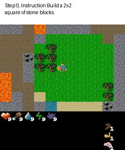

# CAGED - CrafText

CrafText is an extension of the Craftex environment (<https://github.com/MichaelTMatthews/Craftax>). This extension modifies the environment to be goal-oriented, where the agent's objectives are defined by natural language instructions. The extension includes:

- A set of scenarios: These represent the possible goals an agent might have.
- A set of instructions: These are descriptions of the goals. Each goal can have multiple descriptive variants.
- A set of scenario completion checks: Code corresponding to a specific scenario that takes the agent's state as input and returns a boolean value indicating whether the agent has successfully achieved the goal.

  

## Installation

1. Clone the repository.
2. Create a virtual environment and install the dependencies from `requirements.txt`:

   ```bash
   cd docker
   sh build_12cuda.sh
   sh start_12cuda.sh
   ```
   
### Run the PPO Lagrangian in CMDP
   ```bash
   cd baselines
   ```

   ```bash
   python ppo_lag_with_instruction.py --craftext_settings {setting} --env_name="Craftax-Classic-Pixels-v1-Text" --num_envs=512
   ```

        'check_lambda': lambda ...: scenario_function(...): ...  # Example usage of the function
    }
}
```

Replace `instruction_id` with a unique identifier for each instruction, and complete the `check_lambda` to demonstrate how you would verify the given instruction using the function.
