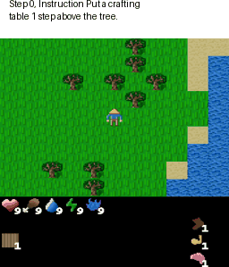
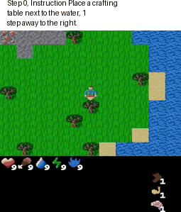

# CrafText

CrafText is an extension of the Craftex environment (https://github.com/MichaelTMatthews/Craftax). This extension modifies the environment to be goal-oriented, where the agent's objectives are defined by natural language instructions. The extension includes:
- A set of scenarios: These represent the possible goals an agent might have.
- A set of instructions: These are descriptions of the goals. Each goal can have multiple descriptive variants.
- A set of scenario completion checks: Code corresponding to a specific scenario that takes the agent's state as input and returns a boolean value indicating whether the agent has successfully achieved the goal.


 


## Installation 

1. Clone the repository.
2. Create a virtual environment and install the dependencies from `requirements.txt`:
   ```bash
   conda create --name craftext python=3.9
   conda activate craftext
   pip install -r requirements.txt
   ```

3. Navigate to the repository and install the dataset:
   ```bash
   cd CrafText
   pip install -e .
   ```


## Run the PPO Baseline

1. Navigate to the `baselines` directory:
   ```bash
   cd baselines
   ```

2. Run the `ppo_with_instruction.py` script:
   ```bash
   python ppo_with_instruction.py
   ```

3. You can configure the settings for the CrafText dataset (i.e., which instructions to use for training) by setting the `--craftext_settings`. 

    ```bash
       python ppo_with_instruction.py --craftext_settings collect_items&&instruction_with_paraphrases&&other
    ```

You can specify your own configuration or choose one from the `./craftext/configs` directory. 

### CrafText dataset configuration file

You can select a subset of the CrafText dataset to use during training by specifying different scenario configurations. The available options include `build`, `base`, `sequential`, `combo`, and `SMALL`. Additionally, you can specify which part of the dataset to use, such as `instructions` or `small`, where `small` refers to a subset containing simpler instructions. You can also choose between using pure instructions or instructions with paraphrases.

To configure your dataset, set the `CRAFTEXT_SETTINGS` environment variable. The format is:

```
<scenario> && <instruction_type> && <subset>
```

Where:
- `<scenario>`: The scenario you want to use (e.g., `build_line`, `collect_items`).
- `<instruction_type>`: Choose either `pure_instruction` or `instruction_with_paraphrases`.
- `<subset>`: Choose from `small_train` for a simpler instruction set, or other custom subsets.

**Examples:**
```bash
export CRAFTEXT_SETTINGS="build_line&&pure_instruction&&small_train"
export CRAFTEXT_SETTINGS="build_line&&instruction_with_paraphrases&&small_train"
export CRAFTEXT_SETTINGS="collect_items&&instruction_with_paraphrases&&other"
```

This allows flexible control over which dataset scenarios and instruction types are used during training.


## Dataset Generation Details
### Instruction and Checker Generation Pipeline

1. Come up with the scenario.
2. Use the standard checker functions and scenario format to write the code for verifying the scenario. Look at the examples (https://github.com/ZoyaV/CrafText/blob/main/checkers/scenarius.py)
3. Use the Instruction Generation Prompt and AskTheCode(ChatGPT4o) to create examples of scenario instructions.

### Instruction Generation Prompt

The code for verifying played scenarios can be found at the following repository link:

https://github.com/ZoyaV/CrafText/blob/main/checkers/scenarius.py

A scenario consists of instructions provided by Player 1 to Player 2. Player 2 follows these instructions, which are then validated by a corresponding function. For the `scenario.py` function, please provide realistic examples of instructions that Player 1 might give, along with 5 paraphrases for each.

**Requirements:**

1. When specifying target objects (objects with which the player will interact), use different synonyms in the paraphrases to assess Player 2's vocabulary range.
2. Present the target objects in varying orders to evaluate how well Player 2 understands different language structures.
3. Sort the paraphrases for each instruction from simplest to most complex language.
4. Ensure the instructions are as varied as possible, utilizing a broad vocabulary.

**Format your answer as a Python dictionary with the following structure:**

```python
instructions = {
    'instruction_id': {
        'instruction': "Example instruction here",
        'instruction_paraphrases': [
            "Paraphrase 1 here",
            "Paraphrase 2 here",
            "Paraphrase 3 here",
            "Paraphrase 4 here",
            "Paraphrase 5 here"
        ],
        'check_lambda': lambda ...: scenario_function(...): ...  # Example usage of the function
    }
}
```

Replace `instruction_id` with a unique identifier for each instruction, and complete the `check_lambda` to demonstrate how you would verify the given instruction using the function.


